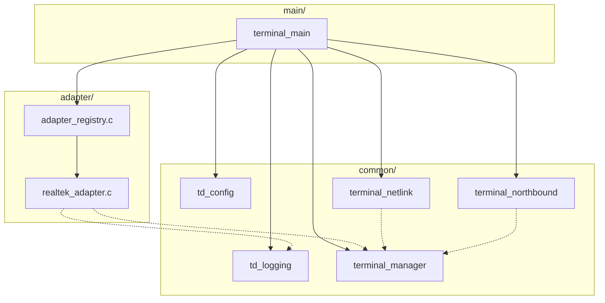
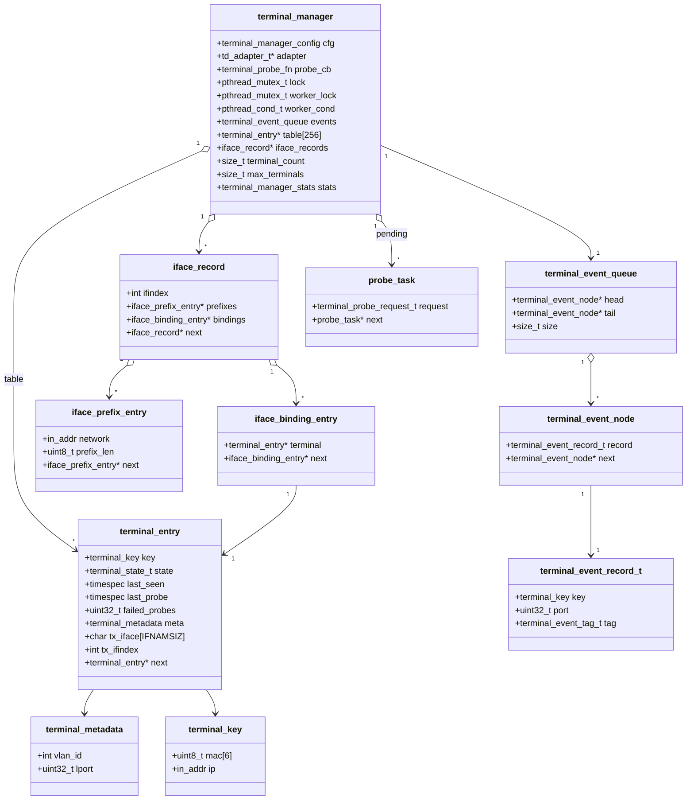
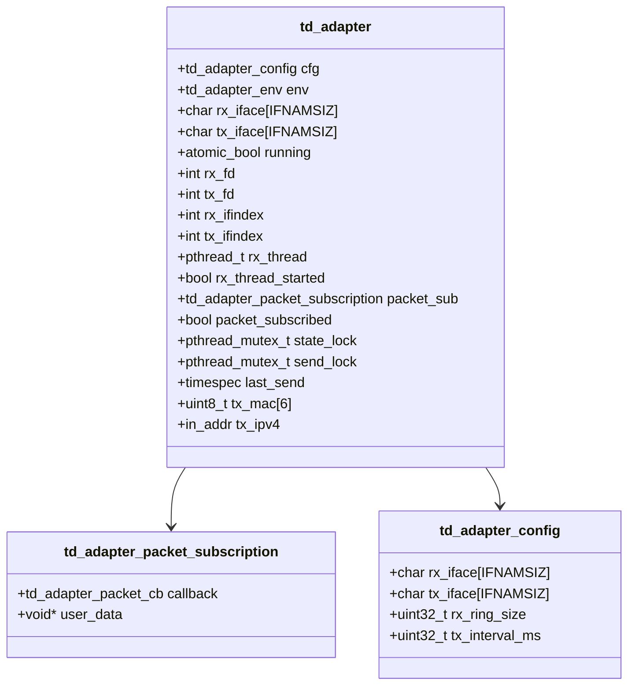
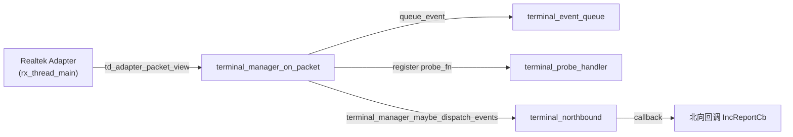
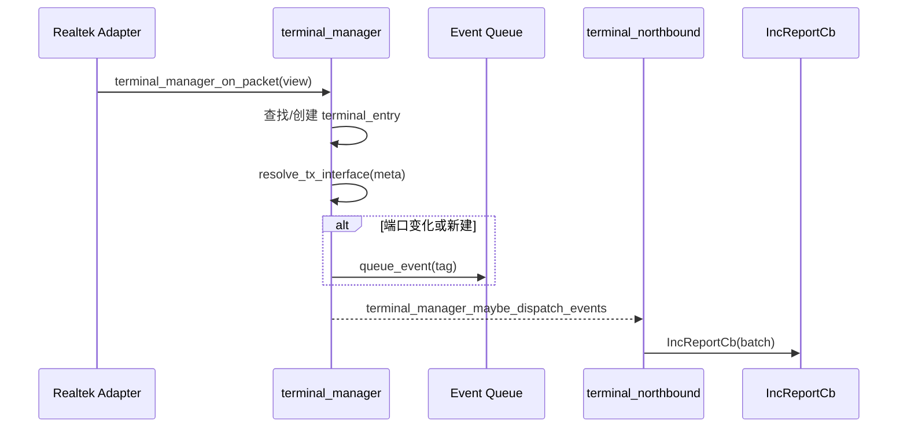
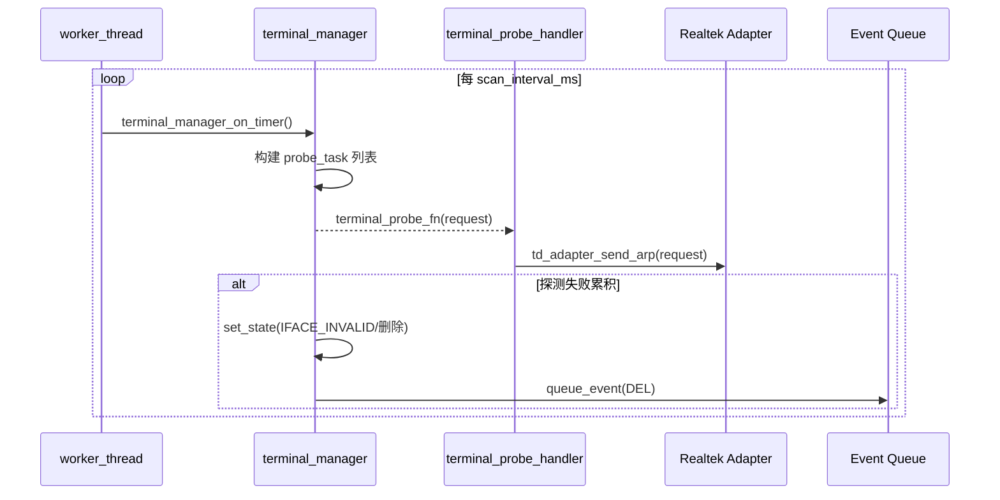
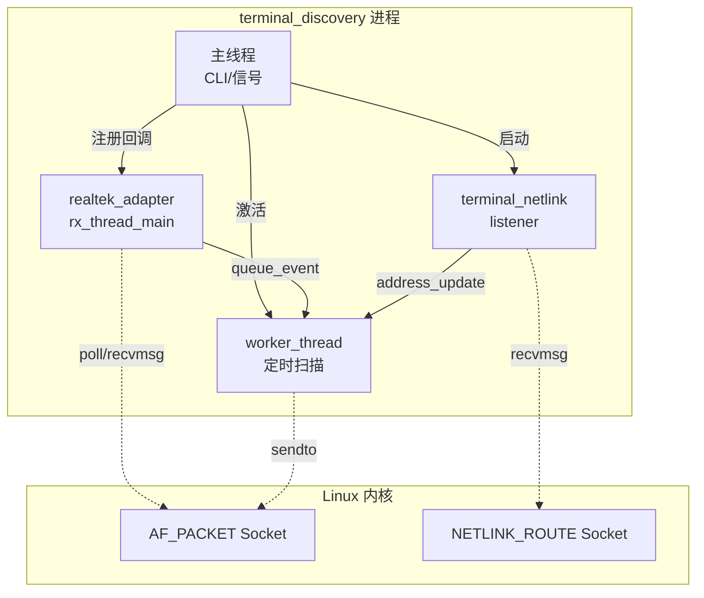

# Terminal Discovery 源码速览

本笔记梳理 `src/` 目录的主要组件、核心数据结构、关键函数和线程模型，便于后续团队成员快速理解与维护终端发现代理。

## 模块分层

```
src/
 ├── common/
 │   ├── td_logging.c/.h
 │   ├── td_config.c/.h
 │   ├── terminal_manager.c/.h
 │   ├── terminal_netlink.c/.h
 │   └── terminal_northbound.cpp / terminal_discovery_api.hpp
 ├── adapter/
 │   ├── adapter_registry.c/.h
 │   └── realtek_adapter.c/.h
 └── main/
     └── terminal_main.c
```

### 架构视图（模块/组件层）



上述组件关系对应 `terminal_main.c` 的初始化流程：主程序拉起配置与日志组件、从 `adapter_registry` 解析适配器、构造 `terminal_manager` 并串联 netlink 监听与北向回调。

### 1. 日志子系统 `common/td_logging`
- 提供线程安全的日志级别、输出接口（`td_log_writef`）。
- 默认写 `stderr`，可通过 `td_log_set_sink` 注入外部回调（适配层使用）。
- `td_log_level_from_string` 支持 CLI 级别解析。

### 2. 运行时配置 `common/td_config`
- `td_config_load_defaults` 输出运行所需的基础参数（适配器名、收发接口、保活周期、容量上限等）。
- `td_config_to_manager_config` 将运行时结构体映射为 `terminal_manager` 的内部配置。
- 默认值与 Stage 4 文档保持一致，可通过 CLI 修改（见 `terminal_main.c`）。

### 3. 平台适配层 `adapter/`
- `adapter_registry` 负责按名称查找适配器（目前仅内置 `realtek`）。
- `realtek_adapter`
  - `td_adapter_ops` 实现：`init/start/stop/register_packet_rx/send_arp/...`
  - **线程模型**：
    - 主线程执行 `init/start` 等生命周期回调。
    - `rx_thread_main` 独立线程轮询 AF_PACKET 套接字，解析 VLAN/ARP，并通过注册的回调上送 `td_adapter_packet_view`。
    - 发送路径在 `send_arp` 内部串行化（互斥锁 + 节流）。
    - `send_lock` 用于保证发送节流 (`last_send`) 与 `sendto` 操作在未来可能的多线程场景下保持串行；当前探测仅来自管理器单线程，即便争用极低，也保留该锁以免后续扩展引入竞态。
  - 所有平台 I/O 均通过原生 Raw Socket 完成，避免依赖平台 SDK。

### 4. 核心引擎 `common/terminal_manager`
- **主要数据结构**：
  - `terminal_manager`
    - 哈希桶 `table[256]` 存储终端条目。
    - 互斥量 `lock` 保护终端表，`worker_thread` 驱动定期扫描。
    - 事件队列 `terminal_event_queue` 存放北向变更通知。
    - 统计字段 `terminal_manager_stats`（Stage 4 新增）。
  - `terminal_entry`
    - 记录 MAC/IP、状态机（`terminal_state_t`）、最近报文时间、探测信息和接口元数据。
  - `terminal_event_record_t`
    - 用于增量事件（`ADD/DEL/MOD`），供北向转换为 `TerminalInfo`。
- **关键函数**：
  - `terminal_manager_create/destroy`：初始化线程、绑定全局单例（`terminal_manager_get_active`）。
  - `terminal_manager_on_packet`：处理适配器上送的 ARP 数据；`apply_packet_binding` 更新 VLAN/lport 元数据并调用 `resolve_tx_interface`，先获取 `ifindex`，再验证终端 IP 是否命中 `iface_address_table` 中该接口的前缀；任一环节失败都会清空绑定并立刻将终端转入 `IFACE_INVALID`。
  - `terminal_manager_on_timer`：由后台线程调用，负责保活探测、过期清理与队列出列；通过回调 `terminal_probe_fn` 执行 ARP 请求。
  - `terminal_manager_on_address_update`：由 netlink 监听器触发的虚接口 IPv4 前缀增删回调，维护可用地址表并触发 `IFACE_INVALID`。
  - `terminal_manager_maybe_dispatch_events`：批量投递事件到北向回调。
  - `terminal_manager_get_stats`：返回当前计数器快照。
- **线程模型**：
  - 后台 `worker_thread` 每 `scan_interval_ms` 唤醒执行 `terminal_manager_on_timer`。
  - 适配器 RX 线程在收到报文后调用 `terminal_manager_on_packet`（持 `lock`）。
  - 北向事件分发在脱锁后执行，避免长时间占用互斥量。

  #### 终端状态机

  `terminal_manager` 中的 `terminal_entry.state` 由 `set_state` 在多个调用点更新，完整流转见下图：

  ```mermaid
  stateDiagram-v2
      [*] --> ACTIVE : 首次有效 ARP
      ACTIVE --> PROBING : 超过 keepalive_interval
      PROBING --> ACTIVE : 收到新的报文
      PROBING --> IFACE_INVALID : 发送前接口失效
      PROBING --> [*] : failed_probes >= threshold
      ACTIVE --> IFACE_INVALID : resolve_tx_interface 失败 / 地址事件取消前缀
      IFACE_INVALID --> ACTIVE : 新报文成功解析接口
      IFACE_INVALID --> PROBING : 接口恢复后由 on_timer 触发探测
      IFACE_INVALID --> [*] : 超过 iface_invalid_holdoff
  ```

  关键判断逻辑分别位于 `terminal_manager_on_packet`、`terminal_manager_on_timer` 与 `terminal_manager_on_address_update` 中：
  - `terminal_manager_on_packet` 负责刷新 `last_seen`、重置 `failed_probes`，并在 `resolve_tx_interface` 成功时将终端转回 `ACTIVE`。
  - `terminal_manager_on_timer` 在超时后生成 `terminal_probe_request_t`，若探测累计失败则删除条目。
  - 地址事件清空可用前缀时会调用 `set_state(...IFACE_INVALID)` 并延迟清理。

#### 数据结构关系

以下类图基于 `terminal_manager.c` 中的结构定义，展示核心管理器、事件队列、接口索引与探测任务之间的关系。



事件、接口索引与探测链路均在 `terminal_manager.lock` 保护下维护：
- 事件队列节点在 `queue_event` 中申请并加入 `terminal_event_queue`，由 `terminal_manager_maybe_dispatch_events` 在脱锁后批量释放。
- `iface_record` 与 `iface_binding_entry` 的增删由 `terminal_manager_on_address_update` 和 `resolve_tx_interface` 驱动，均在持锁状态下保持一致性。
- `probe_task` 链表在 `terminal_manager_on_timer` 内构建（持锁），随后释放锁并逐个执行回调。

### 5. Netlink 监听器 `common/terminal_netlink`
- `terminal_netlink_start/stop`：管理基于 `NETLINK_ROUTE` 的后台线程，订阅 `RTM_NEWADDR/DELADDR` 并调用 `terminal_manager_on_address_update`。
- 内部线程使用 `poll` 阻塞等待消息，解析 `ifaddrmsg` + `IFA_LOCAL/IFA_ADDRESS` 提取前缀信息，只处理 IPv4 事件。
- 在 `terminal_main.c` 中随管理器创建启动，销毁流程会优雅退出线程并关闭套接字。

### 6. 北向桥接 `common/terminal_northbound.cpp`
- 向外导出稳定 ABI：`getAllTerminalInfo`、`setIncrementReport`。
- `setIncrementReport`：注册 C++ 回调 `IncReportCb`，内部通过 `terminal_manager_set_event_sink` 绑定事件入口。
- `getAllTerminalInfo`：调用 `terminal_manager_query_all` 生成快照，转换为 `MAC_IP_INFO`。
- 拥有独立互斥锁 `g_inc_report_mutex` 保证回调注册的线程安全。
- **依赖**：使用 `terminal_manager_get_active` 获取全局管理器指针（由 `terminal_manager_create` 绑定）。

### 7. 主程序 `main/terminal_main.c`
- 负责将上述组件组合成终端发现进程：
  1. `td_config_load_defaults` -> 解析 CLI 参数 -> 设置日志级别。
  2. 查找适配器 (`td_adapter_registry_find`)，初始化 `td_adapter_ops`。
  3. 创建 `terminal_manager`，启动 netlink 监听器，注册事件回调 `terminal_event_logger`。
  4. 将适配器报文回调绑定至 `terminal_manager_on_packet`。
  5. 启动适配器并进入主循环（等待信号退出）。
  6. 收到 SIGINT/SIGTERM 后依次停止适配器、销毁管理器、输出 shutdown 日志。
- `terminal_probe_handler`：实现 `terminal_probe_fn`，将探测请求翻译成 `td_adapter_arp_request` 调用 `send_arp`。
- `terminal_event_logger`：默认注册的事件回调，将终端的 `ADD/DEL/MOD` 变更写入结构化日志，便于观察流水线行为或在没有北向监听器时进行测试验证。
- CLI 支持配置适配器名、接口、保活参数、容量阈值、日志级别等。
- 通过 `adapter_log_bridge` 将适配器内部日志回落至 `td_logging`。

### 平台适配器核心结构

Realtek 适配器内部状态定义于 `realtek_adapter.c`，关键字段及互斥关系如下：



- `state_lock` 保护订阅回调与 RX 线程状态，避免在运行期重入修改。
- `send_lock` 与 `last_send` 实现 ARP 发送节流，确保 `realtek_send_arp` 在多次调用时保持顺序与间隔。
- `running` 原子变量用于 `rx_thread_main` 的退出控制。

## 通信与顺序

终端发现涉及多线程协同。下列 UML 图根据 `realtek_adapter.c`、`terminal_manager.c` 与 `terminal_main.c` 的实现梳理关键交互。

### 通信图：发现链路



1. Realtek 适配器线程在 `rx_thread_main` 中解析 ARP 与 VLAN，封装为 `td_adapter_packet_view` 并回调管理器。
2. `terminal_manager_on_packet` 更新终端表并按需调用 `queue_event` 将 `ADD/MOD` 事件写入队列。
3. 同一线程在脱锁后调用 `terminal_manager_maybe_dispatch_events`，把批量事件交给注册的北向回调。
4. 主线程在初始化阶段通过 `terminal_probe_handler` 注册探测回调，供 worker 线程生成的探测任务调用。

### 顺序图：终端报文到事件上报



此流程覆盖 `terminal_manager_on_packet` 内部的哈希查找、接口绑定、事件入队，以及 `terminal_manager_maybe_dispatch_events` 批量上报逻辑。

### 顺序图：保活探测



探测回调执行于 worker 线程之外，`terminal_probe_handler` 通过适配器的 `send_arp` 与 `send_lock` 节流机制确保与 `realtek_adapter.c` 一致。

## 分配视图（线程与资源）



该视图展示了进程内线程如何占用内核资源：
- Realtek 适配器 RX 线程轮询 `AF_PACKET`，与 worker 线程共享 `td_adapter_send_arp` 输出路径。
- Netlink 线程通过 `NETLINK_ROUTE` 套接字监听 `RTM_NEWADDR/DELADDR`。
- 主线程负责初始化、信号处理和优雅退出，保持与 `terminal_main.c` 的源码一致。

## 多线程与同步

| 线程 | 来源 | 主要职责 | 同步方式 |
| ---- | ---- | -------- | -------- |
| 主线程 | `main()` | CLI 解析、初始化、信号监听、最终清理 | 使用信号处理器设置 `g_should_stop` 原子变量 |
| 适配器 RX 线程 | `realtek_adapter` | `poll` + `recvmsg` 收取 ARP，并调用 `terminal_manager_on_packet` | 访问终端表时依赖 `terminal_manager` 的 `lock` |
| 终端管理器 Worker | `terminal_manager_worker` | 定期扫描终端表、安排探测、淘汰终端 | `worker_lock` 控制线程休眠，核心操作持 `lock` |
| Netlink 监听线程 | `terminal_netlink` | 订阅 `RTM_NEWADDR/DELADDR` 并更新地址表 | 调用 `terminal_manager_on_address_update` 时获取管理器互斥锁 |
| 北向回调（可选） | `terminal_manager_maybe_dispatch_events` | 在脱锁环境调用外部回调 | 事件队列在 `lock` 下构建；回调执行期间不持锁 |

互斥和条件变量主要来源：
- `terminal_manager.lock`：保护终端哈希表、事件队列、统计数据以及 `iface_address_table` / `iface_binding_index`。
- `terminal_manager.worker_lock/cond`：唤醒/停止后台线程。
- `realtek_adapter.state_lock`：保护数据流回调注册。
- `realtek_adapter.send_lock`：串行化 ARP 发送、实现节流。
- `g_inc_report_mutex`：控制北向回调注册。
- `g_active_manager_mutex`：保护全局单例指针 `g_active_manager`，防止多线程并行创建/销毁管理器。

### 资源保护映射

| 锁 / 原子变量 | 保护的资源或不变式 | 主要持有位置 |
| ------------- | ------------------ | ------------ |
| `terminal_manager.lock` | 终端哈希表、事件队列、统计字段、接口前缀表、绑定索引、`probe_task` 链表创建 | `terminal_manager_on_packet`、`terminal_manager_on_timer`、`terminal_manager_on_address_update`、`terminal_manager_get_stats` |
| `terminal_manager.worker_lock` + `worker_cond` | worker 线程睡眠/唤醒与停止标记 | `terminal_manager_start_worker_locked`、`terminal_manager_stop_worker_locked`、`terminal_manager_worker` |
| `g_active_manager_mutex` | 全局活动管理器指针唯一性 | `bind_active_manager`、`unbind_active_manager`、`terminal_manager_get_active` |
| `realtek_adapter.state_lock` | 订阅回调 (`packet_sub`)、RX 线程启动标志 | `realtek_register_packet_rx`、`realtek_start`、`realtek_stop` |
| `realtek_adapter.send_lock` | `last_send` 节流时间戳、`sendto` 调用序列 | `realtek_send_arp` |
| `realtek_adapter.running` (atomic) | 控制 RX 线程循环退出 | `realtek_start`、`realtek_stop`、`rx_thread_main` |
| `g_inc_report_mutex` | 北向增量回调全局句柄 | `setIncrementReport` |

## 关键数据流

1. **发现链路**：
   - Realtek 适配器 (`rx_thread_main`) -> `terminal_manager_on_packet` -> 更新终端状态 -> 入队事件 -> `terminal_manager_maybe_dispatch_events` -> 北向回调/日志。
2. **保活链路**：
   - Worker 线程 (`terminal_manager_on_timer`) -> 决定是否探测 -> `terminal_probe_handler` -> `realtek_adapter.send_arp` -> 网络。
3. **地址事件链路**：
  - Netlink 监听线程 (`terminal_netlink`) -> 解析 `RTM_NEWADDR/DELADDR` -> `terminal_manager_on_address_update` -> 更新地址表与反向索引。
4. **查询接口**：
  - 北向 `getAllTerminalInfo` -> `terminal_manager_query_all` -> C++ 向量结果。
5. **配置入口**：
   - CLI -> `td_runtime_config` -> `td_config_to_manager_config` -> `terminal_manager_create`。

上述 5 条数据流可以结合前述顺序图和分配视图理解跨线程的执行路径，特别是探测调度与事件队列在 `terminal_manager.c` 中的互斥保护与脱锁分发逻辑。

## 维护建议
- 修改 `terminal_manager` 状态机或事件逻辑时，同时更新 `doc/design/stage3_event_pipeline.md` 与相关测试计划。
- 引入新平台适配器需要补充 `adapter_registry` 并实现 `td_adapter_ops` 契约。
- 若扩展 CLI 参数，可在 `terminal_main.c` 增加 `getopt_long` 分支，并同步 Stage 4/overview 文档。
- 修改统计字段时，务必保证在持 `lock` 状态下更新/读取以保持线程安全。

## 参考文档
- `doc/design/stage2_terminal_manager.md`: 终端管理器状态机与调度细节。
- `doc/design/stage3_event_pipeline.md`: 事件队列与北向接口设计。
- `doc/design/stage4_observability.md`: 指标、日志与配置增强说明。

本文档可与上述阶段性设计稿配合使用，帮助新成员快速定位代码入口与线程交互方式。
